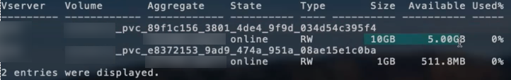

= Opciones y ejemplos de configuración NAS de ONTAP
:hardbreaks:
:allow-uri-read: 
:icons: font
:imagesdir: ../media/

Obtenga más información sobre cómo crear y utilizar controladores NAS de ONTAP con su instalación de Astra Trident. En esta sección, se ofrecen ejemplos de configuración del back-end y detalles sobre cómo asignar back-ends a StorageClasses.

== Opciones de configuración del back-end

Consulte la siguiente tabla para ver las opciones de configuración del back-end:

[cols="3"]
|===
| Parámetro | Descripción | Predeterminado 

| `version` |  | Siempre 1 

| `storageDriverName` | Nombre del controlador de almacenamiento | “ontap-nas”, “ontap-nas-economy”, “ontap-nas-flexgroup”, “ontap-san” y “ontap-san-economy” 

| `backendName` | Nombre personalizado o el back-end de almacenamiento | Nombre del conductor + “_” + dataLIF 

| `managementLIF` | Dirección IP de un LIF de gestión de SVM o clúster para una conmutación de sitios MetroCluster fluida, debe especificar una LIF de gestión de SVM. | “10.0.0.1”, “[2001:1234:abcd::fefe]” 

| `dataLIF` | Dirección IP de LIF de protocolo. Use corchetes para IPv6. No se puede actualizar después de configurarlo | Derivado de la SVM a menos que se especifique 

| `autoExportPolicy` | Habilitar la creación y actualización automática de la política de exportación [booleano] | falso 

| `autoExportCIDRs` | Lista de CIDR para filtrar las IP de nodo de Kubernetes contra cuándo `autoExportPolicy` está habilitado | [“0.0.0.0/0”, “:/0”]” 

| `labels` | Conjunto de etiquetas con formato JSON arbitrario que se aplica en los volúmenes | "" 

| `clientCertificate` | Valor codificado en base64 del certificado de cliente. Se utiliza para autenticación basada en certificados | "" 

| `clientPrivateKey` | Valor codificado en base64 de la clave privada de cliente. Se utiliza para autenticación basada en certificados | "" 

| `trustedCACertificate` | Valor codificado en base64 del certificado de CA de confianza. Opcional. Se utiliza para autenticación basada en certificados | "" 

| `username` | Nombre de usuario para conectarse al clúster/SVM. Se utiliza para autenticación basada en credenciales |  

| `password` | Contraseña para conectarse al clúster/SVM. Se utiliza para autenticación basada en credenciales |  

| `svm` | Máquina virtual de almacenamiento que usar | Derivado si una SVM `managementLIF` está especificado 

| `igroupName` | Nombre del igroup para volúmenes DE SAN que usar | "Trident-<backend-UUID>" 

| `storagePrefix` | El prefijo que se utiliza cuando se aprovisionan volúmenes nuevos en la SVM. No se puede actualizar después de configurarlo | "trident" 

| `limitAggregateUsage` | Error al aprovisionar si el uso supera este porcentaje. *No se aplica a Amazon FSX para ONTAP* | “” (no se aplica de forma predeterminada) 

| `limitVolumeSize` | Error en el aprovisionamiento si el tamaño del volumen solicitado es superior a este valor. | “” (no se aplica de forma predeterminada) 

| `lunsPerFlexvol` | El número máximo de LUN por FlexVol debe estar comprendido entre [50 y 200] | “100” 

| `debugTraceFlags` | Indicadores de depuración que se deben usar para la solución de problemas. Ejemplo, {“api”:false, “method”:true} | nulo 

| `nfsMountOptions` | Lista de opciones de montaje NFS separadas por comas | "" 

| `qtreesPerFlexvol` | El número máximo de qtrees por FlexVol debe estar comprendido entre [50, 300] | “200” 

| `useREST` | Parámetro booleano para usar las API DE REST de ONTAP. *Vista previa técnica* no compatible con MetroCluster. | falso 
|===
[WARNING]
.Consideraciones sobre el </code> de <code> para el "leeleelee
====
* `useREST` se proporciona como **avance técnico** que se recomienda para entornos de prueba y no para cargas de trabajo de producción. Cuando se establece en `true`, Astra Trident utilizará las API DE REST de ONTAP para comunicarse con el back-end. Esta función requiere ONTAP 9.10 o posterior. Además, el rol de inicio de sesión de ONTAP utilizado debe tener acceso a `ontap` cliente más. Esto está satisfecho por el predefinido `vsadmin` y.. `cluster-admin` funciones.
* `useREST` No es compatible con MetroCluster.

====
Para comunicarse con el clúster ONTAP, debe proporcionar los parámetros de autenticación. Puede ser el nombre de usuario o la contraseña de un inicio de sesión de seguridad o un certificado instalado.

WARNING: Si utiliza un entorno de administración de Amazon FSX para ONTAP de NetApp, no especifique el `limitAggregateUsage` parámetro. La `fsxadmin` y.. `vsadmin` Las funciones que ofrece Amazon FSX para ONTAP de NetApp no incluyen los permisos de acceso necesarios para recuperar el uso de agregados y limitarla a través de Astra Trident.

WARNING: No utilizar `debugTraceFlags` a menos que esté solucionando problemas y necesite un volcado de registro detallado.

NOTE: Al crear un back-end, recuerde que `dataLIF` y.. `storagePrefix` no se puede modificar una vez creada. Para actualizar estos parámetros, deberá crear un nuevo backend.

Se puede especificar un nombre de dominio completo (FQDN) para el `managementLIF` opción. También se puede especificar un FQDN para el `dataLIF` Opción, en cuyo caso, se utilizará el FQDN para las operaciones de montaje de NFS. De esta forma puede crear un DNS round-robin para lograr un equilibrio entre la carga en múltiples LIF de datos.

 `managementLIF` Para todos los controladores ONTAP también se puede establecer en direcciones IPv6. Asegúrese de instalar Astra Trident con el `--use-ipv6` bandera. Hay que tener cuidado para definir el `managementLIF` La dirección IPv6 entre corchetes.

WARNING: Cuando se usen direcciones IPv6, asegúrese de `managementLIF` y.. `dataLIF` (si se incluye en su definición de backend) se definen entre corchetes, como [28e8:d9fb:a825:b7bf:69a8:d02f:9e7b:3555]. Si `dataLIF` No se proporciona; Astra Trident recuperará las LIF de datos IPv6 desde la SVM.

Con el `autoExportPolicy` y.. `autoExportCIDRs` Opciones, CSI Trident puede gestionar automáticamente las políticas de exportación. Esto es compatible con todos los controladores ontap-nas-*.

Para la `ontap-nas-economy` controlador, el `limitVolumeSize` Esta opción también restringirá el tamaño máximo de los volúmenes que gestiona para qtrees y LUN, y el `qtreesPerFlexvol` Permite personalizar el número máximo de qtrees por FlexVol.

La `nfsMountOptions` el parámetro puede utilizarse para especificar opciones de montaje. Normalmente, las opciones de montaje para los volúmenes persistentes de Kubernetes se especifican en tipos de almacenamiento, pero si no se especifican opciones de montaje en una clase de almacenamiento, Astra Trident se pondrá en contacto con las opciones de montaje especificadas en el archivo de configuración del back-end de almacenamiento. Si no se especifican opciones de montaje en la clase de almacenamiento o el archivo de configuración, Astra Trident no establecerá ninguna opción de montaje en un volumen persistente asociado.

NOTE: Astra Trident establece etiquetas de aprovisionamiento en el campo "Comentarios" de todos los volúmenes creados mediante(`ontap-nas` y..(`ontap-nas-flexgroup`. Según el controlador utilizado, los comentarios se establecen en FlexVol (`ontap-nas`) O FlexGroup (`ontap-nas-flexgroup`). Astra Trident copiará todas las etiquetas presentes en un pool de almacenamiento al volumen de almacenamiento en el momento en que se aprovisiona. Los administradores de almacenamiento pueden definir etiquetas por pool de almacenamiento y agrupar todos los volúmenes creados en un pool de almacenamiento. Esto proporciona una forma cómoda de diferenciar los volúmenes basándose en un conjunto de etiquetas personalizables que se proporcionan en la configuración del back-end.

=== Opciones de configuración de back-end para el aprovisionamiento de volúmenes

Puede controlar cómo se aprovisiona cada volumen de forma predeterminada mediante estas opciones de una sección especial de la configuración. Para ver un ejemplo, vea los ejemplos de configuración siguientes.

[cols="3"]
|===
| Parámetro | Descripción | Predeterminado 

| `spaceAllocation` | Asignación de espacio para las LUN | “verdadero” 

| `spaceReserve` | Modo de reserva de espacio; “none” (thin) o “VOLUME” (grueso) | “ninguna” 

| `snapshotPolicy` | Política de Snapshot que se debe usar | “ninguna” 

| `qosPolicy` | Grupo de políticas de calidad de servicio que se asignará a los volúmenes creados. Elija uno de qosPolicy o adaptiveQosPolicy por pool/back-end de almacenamiento | "" 

| `adaptiveQosPolicy` | Grupo de políticas de calidad de servicio adaptativo que permite asignar los volúmenes creados. Elija uno de qosPolicy o adaptiveQosPolicy por pool/back-end de almacenamiento. no admitido por ontap-nas-Economy. | "" 

| `snapshotReserve` | Porcentaje del volumen reservado para instantáneas “0” | Si `snapshotPolicy` no es “ninguno”, sino “” 

| `splitOnClone` | Divida un clon de su elemento principal al crearlo | “falso” 

| `encryption` | Habilite el cifrado de volúmenes de NetApp (NVE) en el volumen nuevo; el valor predeterminado es `false`. Para usar esta opción, debe tener una licencia para NVE y habilitarse en el clúster. Si NAE está habilitado en el back-end, cualquier volumen aprovisionado en Astra Trident estará habilitado para NAE. Para obtener más información, consulte: link:../trident-reco/security-reco.html["Cómo funciona Astra Trident con NVE y NAE"]. | “falso” 

| `securityStyle` | Estilo de seguridad para nuevos volúmenes | “unix” 

| `tieringPolicy` | Política de organización en niveles para usar "ninguno" | “Solo Snapshot” para configuración previa a ONTAP 9.5 SVM-DR 

| Permisos univalados | Modo para volúmenes nuevos | “777” 

| Copias Snapshot Dir | Controla la visibilidad de `.snapshot` directorio | “falso” 

| Política de exportoPolicy | Política de exportación que se va a utilizar | “predeterminado” 

| SecurityStyle | Estilo de seguridad para nuevos volúmenes | “unix” 
|===

NOTE: El uso de grupos de políticas de calidad de servicio con Astra Trident requiere ONTAP 9.8 o posterior. Se recomienda utilizar un grupo de políticas de calidad de servicio no compartido y asegurarse de que el grupo de políticas se aplique a cada componente individualmente. Un grupo de políticas de calidad de servicio compartido hará que se aplique el techo para el rendimiento total de todas las cargas de trabajo.

A continuación se muestra un ejemplo con valores predeterminados definidos:

[listing]
----
{
  "version": 1,
  "storageDriverName": "ontap-nas",
  "backendName": "customBackendName",
  "managementLIF": "10.0.0.1",
  "dataLIF": "10.0.0.2",
  "labels": {"k8scluster": "dev1", "backend": "dev1-nasbackend"},
  "svm": "trident_svm",
  "username": "cluster-admin",
  "password": "password",
  "limitAggregateUsage": "80%",
  "limitVolumeSize": "50Gi",
  "nfsMountOptions": "nfsvers=4",
  "debugTraceFlags": {"api":false, "method":true},
  "defaults": {
    "spaceReserve": "volume",
    "qosPolicy": "premium",
    "exportPolicy": "myk8scluster",
    "snapshotPolicy": "default",
    "snapshotReserve": "10"
  }
}
----
Para `ontap-nas` y.. `ontap-nas-flexgroups`, Astra Trident utiliza ahora un nuevo cálculo para garantizar que el tamaño de la FlexVol sea correcto con el porcentaje snapshotReserve y la RVP. Cuando el usuario solicita una RVP, Astra Trident crea el FlexVol original con más espacio mediante el nuevo cálculo. Este cálculo garantiza que el usuario recibe el espacio de escritura que solicitó en el PVC y no menos espacio que el que solicitó. Antes de v21.07, cuando el usuario solicita una RVP (por ejemplo, 5GIB) con el 50 por ciento de snapshotReserve, solo obtiene 2,5 GIB de espacio editable. Esto se debe a que el usuario solicitó es todo el volumen y. `snapshotReserve` es un porcentaje de esta situación. Con Trident 21.07, lo que el usuario solicita es el espacio editable y Astra Trident define el `snapshotReserve` número como porcentaje del volumen completo. Esto no se aplica a. `ontap-nas-economy`. Vea el siguiente ejemplo para ver cómo funciona:

El cálculo es el siguiente:

[listing]
----
Total volume size = (PVC requested size) / (1 - (snapshotReserve percentage) / 100)
----
Para snapshotReserve = 50 % y la solicitud de RVP = 5 GIB, el tamaño total del volumen es 2/.5 = 10 GIB y el tamaño disponible es de 5 GIB, lo que es lo que solicitó el usuario en la solicitud de RVP. La `volume show` el comando debería mostrar resultados similares a los de este ejemplo:

Los back-ends existentes de instalaciones anteriores aprovisionan volúmenes como se explicó anteriormente al actualizar Astra Trident. En el caso de los volúmenes que creó antes de actualizar, debe cambiar el tamaño de sus volúmenes para que se observe el cambio. Por ejemplo, una RVP de 2 GIB con `snapshotReserve=50` Anteriormente, se produjo un volumen que proporciona 1 GIB de espacio editable. Cambiar el tamaño del volumen a 3 GIB, por ejemplo, proporciona a la aplicación 3 GIB de espacio editable en un volumen de 6 GIB.

== Ejemplos de configuración mínima

Los ejemplos siguientes muestran configuraciones básicas que dejan la mayoría de los parámetros en los valores predeterminados. Esta es la forma más sencilla de definir un back-end.

NOTE: Si utiliza Amazon FSX en ONTAP de NetApp con Trident, la recomendación es especificar nombres DNS para las LIF en lugar de direcciones IP.

=== `ontap-nas` controlador con autenticación basada en certificados

Este es un ejemplo de configuración de backend mínima. `clientCertificate`, `clientPrivateKey`, y. `trustedCACertificate` (Opcional, si se utiliza una CA de confianza) se completan en `backend.json` Y tome los valores codificados base64 del certificado de cliente, la clave privada y el certificado de CA de confianza, respectivamente.

[listing]
----
{
  "version": 1,
  "backendName": "DefaultNASBackend",
  "storageDriverName": "ontap-nas",
  "managementLIF": "10.0.0.1",
  "dataLIF": "10.0.0.15",
  "svm": "nfs_svm",
  "clientCertificate": "ZXR0ZXJwYXB...ICMgJ3BhcGVyc2",
  "clientPrivateKey": "vciwKIyAgZG...0cnksIGRlc2NyaX",
  "trustedCACertificate": "zcyBbaG...b3Igb3duIGNsYXNz",
  "storagePrefix": "myPrefix_"
}
----

=== `ontap-nas` controlador con política de exportación automática

En este ejemplo se muestra cómo puede indicar a Astra Trident que utilice políticas de exportación dinámicas para crear y gestionar automáticamente la directiva de exportación. Esto funciona igual para el `ontap-nas-economy` y.. `ontap-nas-flexgroup` de windows

[listing]
----
{
    "version": 1,
    "storageDriverName": "ontap-nas",
    "managementLIF": "10.0.0.1",
    "dataLIF": "10.0.0.2",
    "svm": "svm_nfs",
    "labels": {"k8scluster": "test-cluster-east-1a", "backend": "test1-nasbackend"},
    "autoExportPolicy": true,
    "autoExportCIDRs": ["10.0.0.0/24"],
    "username": "admin",
    "password": "secret",
    "nfsMountOptions": "nfsvers=4",
}
----

=== `ontap-nas-flexgroup` controlador

[listing]
----
{
    "version": 1,
    "storageDriverName": "ontap-nas-flexgroup",
    "managementLIF": "10.0.0.1",
    "dataLIF": "10.0.0.2",
    "labels": {"k8scluster": "test-cluster-east-1b", "backend": "test1-ontap-cluster"},
    "svm": "svm_nfs",
    "username": "vsadmin",
    "password": "secret",
}
----

=== `ontap-nas` Controlador con IPv6

[listing]
----
{
 "version": 1,
 "storageDriverName": "ontap-nas",
 "backendName": "nas_ipv6_backend",
 "managementLIF": "[5c5d:5edf:8f:7657:bef8:109b:1b41:d491]",
 "labels": {"k8scluster": "test-cluster-east-1a", "backend": "test1-ontap-ipv6"},
 "svm": "nas_ipv6_svm",
 "username": "vsadmin",
 "password": "netapp123"
}
----

=== `ontap-nas-economy` controlador

[listing]
----
{
    "version": 1,
    "storageDriverName": "ontap-nas-economy",
    "managementLIF": "10.0.0.1",
    "dataLIF": "10.0.0.2",
    "svm": "svm_nfs",
    "username": "vsadmin",
    "password": "secret"
}
----

== Ejemplos de back-ends con pools de almacenamiento virtuales

En el archivo de definición del back-end de ejemplo que se muestra a continuación, se establecen valores predeterminados específicos para todos los grupos de almacenamiento, como `spaceReserve` en ninguno, `spaceAllocation` en falso, y. `encryption` en falso. Los pools de almacenamiento virtual se definen en la sección de almacenamiento.

En este ejemplo, algunos de los recursos compartidos de almacenamiento son los suyos propios `spaceReserve`, `spaceAllocation`, y. `encryption` los valores y algunos pools sobrescriben los valores predeterminados establecidos anteriormente.

=== `ontap-nas` controlador

[listing]
----
{
    {
    "version": 1,
    "storageDriverName": "ontap-nas",
    "managementLIF": "10.0.0.1",
    "dataLIF": "10.0.0.2",
    "svm": "svm_nfs",
    "username": "admin",
    "password": "secret",
    "nfsMountOptions": "nfsvers=4",

    "defaults": {
          "spaceReserve": "none",
          "encryption": "false",
          "qosPolicy": "standard"
    },
    "labels":{"store":"nas_store", "k8scluster": "prod-cluster-1"},
    "region": "us_east_1",
    "storage": [
        {
            "labels":{"app":"msoffice", "cost":"100"},
            "zone":"us_east_1a",
            "defaults": {
                "spaceReserve": "volume",
                "encryption": "true",
                "unixPermissions": "0755",
                "adaptiveQosPolicy": "adaptive-premium"
            }
        },
        {
            "labels":{"app":"slack", "cost":"75"},
            "zone":"us_east_1b",
            "defaults": {
                "spaceReserve": "none",
                "encryption": "true",
                "unixPermissions": "0755"
            }
        },
        {
            "labels":{"app":"wordpress", "cost":"50"},
            "zone":"us_east_1c",
            "defaults": {
                "spaceReserve": "none",
                "encryption": "true",
                "unixPermissions": "0775"
            }
        },
        {
            "labels":{"app":"mysqldb", "cost":"25"},
            "zone":"us_east_1d",
            "defaults": {
                "spaceReserve": "volume",
                "encryption": "false",
                "unixPermissions": "0775"
            }
        }
    ]
}
----

=== `ontap-nas-flexgroup` controlador

[listing]
----
{
    "version": 1,
    "storageDriverName": "ontap-nas-flexgroup",
    "managementLIF": "10.0.0.1",
    "dataLIF": "10.0.0.2",
    "svm": "svm_nfs",
    "username": "vsadmin",
    "password": "secret",

    "defaults": {
          "spaceReserve": "none",
          "encryption": "false"
    },
    "labels":{"store":"flexgroup_store", "k8scluster": "prod-cluster-1"},
    "region": "us_east_1",
    "storage": [
        {
            "labels":{"protection":"gold", "creditpoints":"50000"},
            "zone":"us_east_1a",
            "defaults": {
                "spaceReserve": "volume",
                "encryption": "true",
                "unixPermissions": "0755"
            }
        },
        {
            "labels":{"protection":"gold", "creditpoints":"30000"},
            "zone":"us_east_1b",
            "defaults": {
                "spaceReserve": "none",
                "encryption": "true",
                "unixPermissions": "0755"
            }
        },
        {
            "labels":{"protection":"silver", "creditpoints":"20000"},
            "zone":"us_east_1c",
            "defaults": {
                "spaceReserve": "none",
                "encryption": "true",
                "unixPermissions": "0775"
            }
        },
        {
            "labels":{"protection":"bronze", "creditpoints":"10000"},
            "zone":"us_east_1d",
            "defaults": {
                "spaceReserve": "volume",
                "encryption": "false",
                "unixPermissions": "0775"
            }
        }
    ]
}
----

=== `ontap-nas-economy` controlador

[listing]
----
{
    "version": 1,
    "storageDriverName": "ontap-nas-economy",
    "managementLIF": "10.0.0.1",
    "dataLIF": "10.0.0.2",
    "svm": "svm_nfs",
    "username": "vsadmin",
    "password": "secret",

    "defaults": {
          "spaceReserve": "none",
          "encryption": "false"
    },
    "labels":{"store":"nas_economy_store"},
    "region": "us_east_1",
    "storage": [
        {
            "labels":{"department":"finance", "creditpoints":"6000"},
            "zone":"us_east_1a",
            "defaults": {
                "spaceReserve": "volume",
                "encryption": "true",
                "unixPermissions": "0755"
            }
        },
        {
            "labels":{"department":"legal", "creditpoints":"5000"},
            "zone":"us_east_1b",
            "defaults": {
                "spaceReserve": "none",
                "encryption": "true",
                "unixPermissions": "0755"
            }
        },
        {
            "labels":{"department":"engineering", "creditpoints":"3000"},
            "zone":"us_east_1c",
            "defaults": {
                "spaceReserve": "none",
                "encryption": "true",
                "unixPermissions": "0775"
            }
        },
        {
            "labels":{"department":"humanresource", "creditpoints":"2000"},
            "zone":"us_east_1d",
            "defaults": {
                "spaceReserve": "volume",
                "encryption": "false",
                "unixPermissions": "0775"
            }
        }
    ]
}
----

== Asigne los back-ends a StorageClass

Las siguientes definiciones de StorageClass se refieren a los pools de almacenamiento virtual anteriores. Con el `parameters.selector` Field, cada clase de almacenamiento llama a qué pools virtuales se pueden utilizar para alojar un volumen. El volumen tendrá los aspectos definidos en el pool virtual elegido.

* El primer tipo de almacenamiento (`protection-gold`) se asignará al primer, segundo grupo de almacenamiento virtual del `ontap-nas-flexgroup` back-end y el primer pool de almacenamiento virtual del `ontap-san` back-end. Se trata de la única piscina que ofrece protección de nivel Gold.
* El segundo tipo de almacenamiento (`protection-not-gold`) se asignará al tercer y cuarto bloque de almacenamiento virtual en `ontap-nas-flexgroup` back-end y el segundo, tercer pool de almacenamiento virtual del `ontap-san` back-end. Estos son los únicos pools que ofrecen un nivel de protección distinto al Gold.
* El tercer tipo de almacenamiento (`app-mysqldb`) se asignará al cuarto bloque de almacenamiento virtual en `ontap-nas` back-end y el tercer pool de almacenamiento virtual de `ontap-san-economy` back-end. Estos son los únicos grupos que ofrecen la configuración del pool de almacenamiento para la aplicación de tipo mysqldb.
* El cuarto tipo de almacenamiento (`protection-silver-creditpoints-20k`) se asignará al tercer grupo de almacenamiento virtual en `ontap-nas-flexgroup` back-end y el segundo pool de almacenamiento virtual de `ontap-san` back-end. Estas son las únicas piscinas que ofrecen protección de nivel Gold con 20000 puntos de crédito.
* El quinto tipo de almacenamiento (`creditpoints-5k`) se asignará al segundo grupo de almacenamiento virtual en `ontap-nas-economy` back-end y el tercer pool de almacenamiento virtual de `ontap-san` back-end. Se trata de la única oferta de pool en 5000 puntos de crédito.

Astra Trident decidirá qué pool de almacenamiento virtual se selecciona y garantizará que se cumplan los requisitos de almacenamiento.

[listing]
----
apiVersion: storage.k8s.io/v1
kind: StorageClass
metadata:
  name: protection-gold
provisioner: netapp.io/trident
parameters:
  selector: "protection=gold"
  fsType: "ext4"
---
apiVersion: storage.k8s.io/v1
kind: StorageClass
metadata:
  name: protection-not-gold
provisioner: netapp.io/trident
parameters:
  selector: "protection!=gold"
  fsType: "ext4"
---
apiVersion: storage.k8s.io/v1
kind: StorageClass
metadata:
  name: app-mysqldb
provisioner: netapp.io/trident
parameters:
  selector: "app=mysqldb"
  fsType: "ext4"
---
apiVersion: storage.k8s.io/v1
kind: StorageClass
metadata:
  name: protection-silver-creditpoints-20k
provisioner: netapp.io/trident
parameters:
  selector: "protection=silver; creditpoints=20000"
  fsType: "ext4"
---
apiVersion: storage.k8s.io/v1
kind: StorageClass
metadata:
  name: creditpoints-5k
provisioner: netapp.io/trident
parameters:
  selector: "creditpoints=5000"
  fsType: "ext4"
----